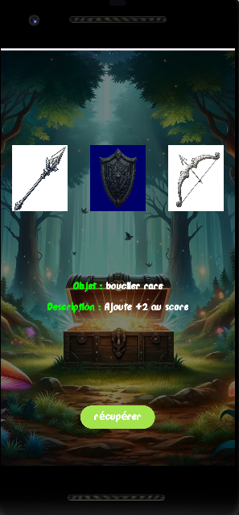
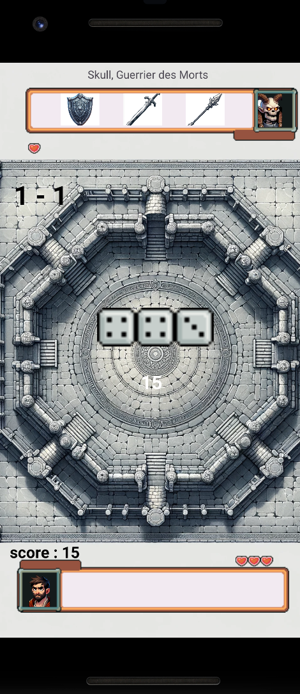

# Jeu dont vous êtes le héros

## Contexte
Comme dans les “livres dont vous êtes le héros”, ce projet vise à améliorer une application existante pour permettre l'intégration de scénarios échangeables. Les utilisateurs pourront ainsi naviguer entre différentes situations, collecter des objets uniques et affronter des adversaires, tout en influençant le déroulement de leur aventure par leurs choix.

## Sources
Les données nécessaires sont disponibles sur le [moodle R4A11](https://moodlelms.univ-paris13.fr/course/view.php?id=6724).

La programmation se fera obligatoirement avec Android Studio. Un serveur sera mis à disposition pour héberger les assets au fur et à mesure de l'avancée du projet.

Divers logiciels seront nécessaires pour la soumission des livrables. Ce document sera complété au fur et à mesure de l'avancement du projet.

## Livrables
- **Composition de l’équipe** : Groupe de 3 ou 4 personnes, planification des rôles (texte, 19 avril 2024, rendu collectif)
  - Compétence 5
- **Documentation JSON** : Explication du codage des “aventures” au format JSON (texte, 19 avril 2024, rendu collectif)
- **Mécanisme de bagarre** : Proposition et étude statistique des résultats (texte, 26 avril 2024, rendu collectif)
- **Aventure test** : Proposition d’une aventure test pour essayer le jeu (fichiers informatiques, 26 avril 2024, rendu collectif, rendu évolutif)

## Besoins de l'application
### Jeu
Le jeu permet aux joueurs de se déplacer d’une situation à une autre, de collecter des objets uniques, et d’affronter des adversaires. Chaque lieu propose des choix permettant de naviguer vers d’autres situations, avec des rencontres débloquant des situations supplémentaires.

### Possibilités offertes
#### Objets
Les objets sont uniques et définis par une description textuelle, un identifiant, et une icône PNG 32x32. Certains choix sont accessibles uniquement si le joueur possède certains objets. Les objets peuvent être acquis, affichés pour débloquer des choix, et détruits en fonction des situations.

#### Rencontres
Les rencontres, associées à chaque situation, sont décrites sous forme de tableau et activent un mode combat interactif. Les combats utilisent des scores chiffrés (entre 1 et 6) et une composante aléatoire, dépendant des objets possédés par le joueur. Les résultats de rencontres débloquent des situations spécifiques et peuvent entraîner l’acquisition d’objets uniques.

